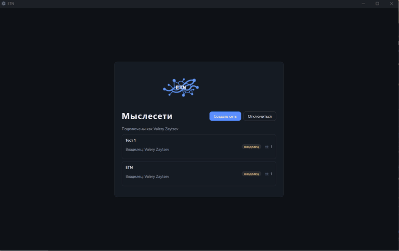

# ETN — The Endless Thought Network

Бесплатный self-hosted «цифровой мозг»: заметки, идеи, задачи и файлы живут не
в папках, а в виде направленного графа связанных мыслей, который можно
листать, как разум — от общего к частному и обратно. Вдохновлён TheBrain, но
не копирует его, а развивает собственные методики работы с информацией — свой
сервер, свои данные, никаких подписок и облаков.

 



## Ключевые возможности

- 🧠 **Граф мыслей, а не иерархия папок.** Мысль может иметь сколько угодно
  родителей и детей, между любыми двумя — прямая связь. Холст показывает
  фокусную мысль и её окружение и позволяет мгновенно «прыгать» по сети.
- 👥 **Совместная работа в реальном времени.** Несколько пользователей
  одновременно правят одну мыслесеть — изменения появляются у всех без
  перезагрузки и обновления страниц.
- 🤖 **Доступ для AI-агентов через MCP.** Встроенный MCP-сервер даёт внешним
  ИИ-ассистентам (Claude, ZCode и другим MCP-клиентам) читать и пополнять базу
  знаний: поиск, структурная выборка, подграфы, создание и правка мыслей,
  дедупликация «из коробки» — без плагинов и интеграций.
- 🔍 **Полнотекстовый поиск и типизация.** FTS5-поиск по названиям, комментариям
  и связям; у мыслей есть типы со своими свойствами, что превращает граф в
  структурированную базу знаний, а не просто в mind map.
- 📝 **Markdown-комментарии с вики-ссылками.** Постоянный и хронологические
  комментарии к каждой мысли, вложения файлов и URL, ссылки `[[...]]` между
  мыслями и сетями.
- 🔐 **Собственная инфраструктура, простая модель доступа.**Self-hosted сервер
  на своей машине или в своей сети, аутентификация по API-key, три уровня
  доступа (админ → владелец сети → участник) — без вендор-лока и внешних
  зависимостей.
- 💻 **Десктоп-клиент под все ОС + REST/WebSocket API.** Готовый Electron-клиент
  для Windows/macOS/Linux, а для собственных интеграций — открытый HTTP/WS API.

## Статус

✅ MVP собран и находится в тестовой эксплуатации: проект развивается по отчётам
пользователей-тестировщиков. План работ — [`docs/workplan.md`](docs/workplan.md)
(индекс: статусы фаз и ключевые решения; описания задач — в `docs/workplan/`,
по файлу на фазу).

## Спецификации

Полный комплект проектных спецификаций (архитектура, модель данных, REST API,
real-time, MCP, аутентификация, клиент, UI, сценарии, словарь, настройки) — в
каталоге [`docs/`](docs/). Начать знакомство с [`docs/README.md`](docs/README.md).

## Стек

- **Сервер:** Node.js 20+ (**рекомендуется 22 LTS** — для него у better-sqlite3 есть готовая prebuilt-binary; на Node 24 потребуется Python в PATH для компиляции), TypeScript, Fastify, better-sqlite3, WebSocket.
- **Клиент:** Electron, TypeScript.
- **Хранилище:** SQLite — одна `_system.db` + `networks/<id>/data.db` на сеть.
- **MCP:** `@modelcontextprotocol/sdk`.

## Структура монорепо

```
etn/
├── docs/      # спецификации и план работ
├── server/    # серверное приложение + CLI (etn init)
├── client/    # десктоп-клиент на Electron
├── shared/    # общие типы (DTO, константы, протоколы real-time)
└── package.json
```

## Разработка

```bash
npm install              # установить зависимости всех workspaces
npm run dev:server       # запуск сервера в режиме разработки
npm run dev:client       # запуск клиента
npm run typecheck        # проверка типов во всех workspaces
npm test                 # все тесты
```

## Установка

- **Сервер** — Docker (`docker compose up -d`) или Node.js 22 из исходников;
  подробно — [`docs/install-server.md`](docs/install-server.md).
- **Клиент** — готовые установщики (Windows/macOS/Linux) в
  [релизах](https://github.com/nerkuda/e-tho-net/releases); из исходников —
  [`docs/install-client.md`](docs/install-client.md).

## Лицензия

Проект распространяется под [MIT License](LICENSE).

## Создано с помощью ИИ

Этот проект полностью (на 100%) написан с помощью нескольких LLM и AI-агента
[ZCode](https://zcode.z.ai) — настольной агентной среды разработки.
