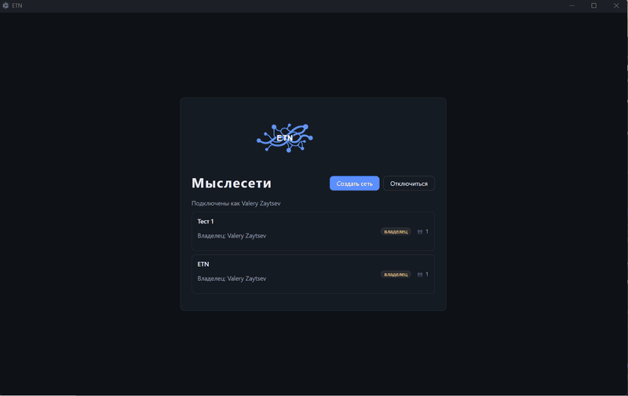

# История создания ETN

*Краткая — и потому слегка неполная — повесть о том, как отпуск, отвалившаяся
синхронизация и один принципиальный эксперимент превратились в «The Endless
Thought Network».*

## Отпуск, который начался с огорчения

В августе 2026 года автор ETN был в отпуске — то есть по всем человеческим
правилам не собирался ничего разрабатывать. Он просто обновил программу, которой
пользовался много лет: TheBrain, «цифровой мозг», где заметки живут не в папках,
а в виде графа связанных мыслей.

Обновление принесло кучку ... огорчений. Синхронизация отвалилась. Что-то
стало платным. Что-то просто перестало устраивать. А пожелания и ошибки, годами
висевшие в списке, имели все шансы висеть там и дальше.

> «Закрыл программу и решил сделать себе свой „TB“. Естественно, с помощью AI.»

Так у истории появился замысел: не копия TheBrain, а свой инструмент — в которой
сохранилось бы главное (мысли и связи вместо папок), но добавилось бы то, чего
в чужой программе не хватало: нечувствительность к склонениям при поиске, наборы
свойств, датированные записи, свои правила на каждый тип записи.

Название придумалось быстро: **ETN — The Endless Thought Network**, «бесконечная
сеть мыслей».

## Четыре дня, пятнадцать долларов

Первыми в репозитории появились не строки кода, а спецификации: что за система,
из чего состоит, как должна вести себя. Только потом — каркас программы. Первый
коммит датирован 12 августа 2026 года.

С этого дня и до конца отпуска работа шла по скромному графику: не больше
четырёх часов в день (отпуск всё-таки). Через четыре дня в репозитории стоял тег
**0.1.0** — первый рабочий срез: сервер, клиент, обмен данными в реальном времени
и уже тогда — мостик к ИИ-агентам (MCP), через который внешний искусственный
интеллект мог читать и пополнять базу.

> «4 дня (не более 4 часов в день — отпуск, всё же), около $15 — и MVP был готов.
> Потом понеслось: хочу предпросмотр с зажатым Ctrl, а хочу ручной порядок
> перетаскиванием, хочу слои изменений, хочу ещё вот это и вот так…»

Именно так и началась вторая, гораздо более длинная часть истории: «понеслось».

## Дальше — больше: как хотелки стали версиями

В номерах версий вторая цифра — это не просто число, а глава. Главы ETN
нанизывались довольно быстро, и у каждой было своё лицо.

> «Самые тяжелые хотелки реализуются часа за 3–5. А что попроще — за 5–30 минут.
> Вместе с тестами».

**0.1 — «Оно живое» (16 августа).** Мысль можно создать, связать с другой и
увидеть на холсте: в центре — мысль в фокусе, вокруг — её окружение. Мыслями
могут быть люди, книги, организации, идеи — всё, что хочется связать с чем-то
ещё. Связи — это и есть содержание: не папка, а отношение.

**0.2 — «Учимся писать» (18 августа).** Текст заметок переехал в настоящий
редактор с живым форматированием: Markdown, ссылки на другие мысли по имени,
картинки, диаграммы. Мысли получили иконки, а облачка на холсте — умение
перетаскиваться мышью.

**0.3 — «Порядок в размышлениях» (21 августа).** Появилась «Хроника» (с 0.10.1 —
«Дневник») — лента
датированных записей к мыслям, третья рабочая поверхность рядом с холстом и
редактором. Закреплённые мысли — как закладки под рукой. А типы мыслей и связей
стали иерархичными: у типа может быть родитель, и дерево типов видно целиком.

**0.4 — «Больше одной сети» (24 августа).** В одном окне — несколько мыслесетей
сразу, переключение вкладками. Экспорт и импорт `.etnx` — формат переноса базы
целиком или ветки целиком. Ссылки между мыслями стали надёжными: по
идентификатору, а не по имени, — значит, переименование больше ничего не ломает.
Следом вышли пять хотфиксов — работа над ошибками: вложения при подключении
к удалённому серверу, буфер обмена, мелочи интерфейса.

**0.5 — «Осторожные перемены» (28 августа — 2 сентября).** Сначала — корзина:
удаление стало двухфазным, мысль можно пометить и передумать, а «удалить совсем»
требует отдельного решения. Потом — главное: **слои изменений**. Слой — это
калька поверх базы: в нём можно свободно править, экспериментировать и даже
переписывать целые куски, а основа всё это время остаётся нетронутой. Понравилось
— слой сливается с основой; не понравилось — слой выбрасывается бесследно.

**0.6 — «Конструктор» (2–6 сентября).** Типы и свойства перестали быть
внутренней кухней и стали полноценными сущностями, которые пользователь собирает
сам: справочник свойств сети, подключение свойств к типам, свойства «вне типа» —
нужные конкретной мысли, хотя и не заданные её типом. Добавились мелочи, без
которых жить нельзя: предпросмотр содержимого по Ctrl+наведению, создание мыслей
и типов «на месте», подсказки последних значений.

**0.7 — «Вместе» (6–11 сентября).** Программа научилась работать с несколькими
людьми и агентами одновременно: у записей появилось авторство, у правок —
блокировка («эту мысль сейчас правят»), у сети — журнал событий: кто, что и
когда. И «отборы» — живые подборки, настраиваемые для типа мысли: «Главы
в работе», «Источники по теме». Настраивается один раз, а кнопка появляется
прямо на карте.

**0.8 — «Связи становятся свойствами».** Самое крупное внутреннее
изменение историю разработки. Раньше у мысли было два похожих списка: свойства
(«год издания», «жанр») и связи («относится к жанру», «входит в состав») — и то
и другое жило по своим правилам. И приходилось выбирать, что лучше: свзяывать 
книгу с жанром, или указывать жанр в свойствах? Теперь связь — тоже свойство, 
просто особого рода, и когда заполяются свойства у мысли автоматически создаются 
связи с другими мыслями. А видимость таких связей выбирается пользователем по мере 
надобности. Для агентов такая модель строже и понятней, для человека - не 
напряжная, удобно обоим.

**0.9 — «Стандартизация дизайна и ускорение работы» (24–26 сентября).** Программа 
росла быстро, агенты творили каждый что хотел. В результате одни и те же поля на 
разных экранах выглядели по разному и действовали не одинаково. Возникала нуждв в 
новом диалоге - агент творил его заново и снова не похожим на другие. Автор решил,
что пора заняться дизайн-системой, и не только ради внешнего вида, но и чтобы 
ускорить разработку и упростить поддержку. Пока тестировал дизайн-систему, начал 
натыкаться на тормоза в некоторых местах интерфейса. Потому в этой же версии 
занялся и оптимизацией запросов. В результате что занимало секунды, отвечает 
мгновенно, а отдельные отборы ускорились в сотни раз.

**0.10 — «Дневник и упрямые агенты» (с 26 сентября).** Решено превратить хроно-
записи в удобный и эффективный рабочий дневник. Ведение ежедневника, фиксация
событий, совещаний, записи на скорую руку, и чтобы все это было доступно именно 
там, где оно должно быть. Старт получился бодрым, но на финише выяснилось, что 
агенты "читали" про дизайн-систему, но продолжают выдумывать свои формы, поля, 
диалоги... На этапе приемки приходилось по нескольку раз заставлять их применять 
одни и теже компоненты вместо своих "самописок". Убийственно! Пришлось 
переустраивать весь процесс разработки и тестирования. У автора появился 
независимый агент-контролер, которого научили запускать приложение и визуально 
проверять требования визуально. Это оказалось болезненным - теперь реализация 
каждой задачи занимает в 2-3 раза больше времени, в то время как автор рассчитывал 
на обратное после введения дизайн-системы. Но зато ему теперь меньше приходится
самому в интерфейсе тестировать - болшьую часть выполняет новый агент.

**0.11 — «Документы из кучи мыслей» (1–5 октября).** База знаний — россыпь
атомарных мыслей. Для поиска и агентов это идеально, но для передачи другим 
нужен документ: с оглавлением, порядком, связанным изложением. Возможно, со
ссылками на доп.информаци. Для этого появились публикации — «живой вид» 
мыслесети. Заголовок раздела — это название мысли, текст — её комментарий и,
если нужно - связанные мысли. Документ собирается по рецепту (настройка 
отбора), а потому любые изменения в мылсесети немедленно отражаются в 
публикации. 
Библиотека с полками, чтение с оглавлением, экспорт в Markdown, HTML и PDF, 
а для репозитория — детерминированная пересборка всего комплекта одной
командой. Попутно клиент получил реактивный слой живого обновления, а 
MCP-контур сел на диету: вместо полусотни инструментов — компактный набор 
да справочник, откуда можно узнать о редких операциях.

**0.12 — «Развитие редактора, трансклюзии, библиотеки иконок» (5-10 октября)** 
Это можно считать мелкими улучшениями, которые откладывались на потом в 
течение нескольких версий. Но теперь редактировать комментарии и 
визуализировать свои мысли стало значительно удобней и приятней.
Трансклюзии — живые вставки комментариев других мыслей: правишь текст 
и он обновляется в источнике и во всех остальных местах использования. 
Записи ежедневника (и не только) можно запросто нарезать на отдельные мысли.
Готовить публикации стало удобней и проще.
Попутно документация самого ETN стала обычными публикациями. Спецификации и
руководства больше не правятся руками и не протухают в файлах — комплект 
в `docs/` генерируется из мыслесети при выпуске новых версий. 

## Несколько показательных числел

Сравнивать ETN с TheBrain всерьёз автор не берётся: у приложений разные 
задачи и подходы к их решению. Но определить эффективность работ можно только
в сравнении:

| | TheBrain | ETN |
|---|---|---|
| Сколько развивается | 28 лет | 8 недель |
| Цена нужного набора возможностей | $29 в месяц (всего 60% желаемого функционала) | около $280 (пока, но уже 80% желаемого) |
| Срок исполнения пожелания | годы | минуты, редко — часы |
| Где живёт база | локально, с синхронизацией через сервер вендора | локально (сервер), с доступом на любом количестве клиентов |
| Совместная работа | другой продукт со своей лицензей и стоимостью | бесплатно, в том же приложении |

Точнее стоимость определить не получится: подписки на ИИ используются не только
для этого проекта. И сумма затрат на свою разработку явно превысит годовую 
подписку на готовый продукт. Однако, тонкая заточка инструмента под конкретные
потребности автора и возможность поправить все, что ему потребуется, всего за
несколько минут-часов — перевешивает. 

## Неожиданное: граф оказался удобен не только человеку

Поначалу это была просто база знаний автора. Но когда к программе подключились
ИИ-агенты — а именно для этого в ней с самого начала был предусмотрен MCP — 
выяснилась интересная вещь: граф типизированных связанных мыслей для агентов 
едва ли не удобней, чем для человека. Они быстро находили нужное сразу вместе
со всей «семантикой»: от чего зависит, где реализуется, какие с этим были 
проблемы. Даже у не самых дорогих моделей появилась невиданная до того 
прозорливость.

> Меньше токенов, чище контекст, точнее решения.

Дальше — больше: агенты посторили для себя отдельную мыслесеть и постепенно 
перенесли в нее не только знания по проекту, но и управление всем процессом
разработки. Сегодня ETN проектируется, разрабатывается и документируется в
самом ETN. Агенты пишут тех.проекты и задачи, кодируют по спецификациям, 
независимо проверяют друг друга, регистрируют ошибки и задачи, собирают 
changelog и публикуют релизы на GitHub. Автор принципиально не заглядывает
в кодовую базу и контролирует работы исключительно в той же мыслесети.
Как устроена эта кухня — рассказано тут: 
[development-in-etn.md](development-in-etn.md).

## Личная база знаний: второй мозг заработал

Сегодня ETN — ежедневный инструмент автора, не смотря на то, что еще не
вся информация перенесена туда из прежних баз знаний. В личной мыслесети 
живут друзья, организации и их контакты, теоретические знания, исследования
на разные темы, постоянные мысли и выводы. Появились у автора и первые
публикации.

Существует еще и несколько мыслесетей по рабочим проектам. Большинство
используются совместно с коллегами и агентами. Один сервер, много
сетей: работа, жизнь и разработка не перемешиваются, но живут по одним
правилам.

## Вместо послесловия

> Для автора этот проект — эксперимент по разработке инструмента, при которой 
> он ни разу не прочитал и не написал ни единой строчки кода. При этом продукт
> вполне рабочий, используется ежедневно, критичных ошибок пока не возникало.

На текущий момент автор делает уверенный вывод: разработка сложных систем
без человеческого кодирования возможна.

---

- Исходный код: <https://github.com/nerkuda/e-tho-net>
- Документация: <https://github.com/nerkuda/e-tho-net/tree/main/docs>

